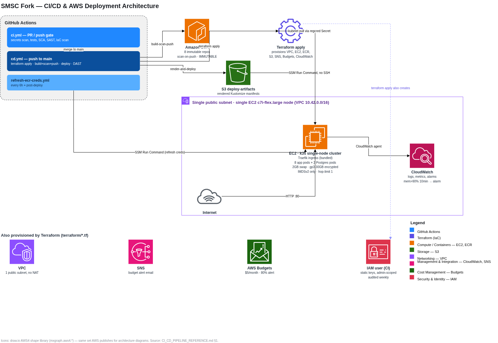

# CI/CD Pipeline Reference

This document explains, file by file, how this fork's CI/CD pipeline is built: what each GitHub Actions workflow does, why it's designed the way it is, and which tools it relies on. It is scoped narrowly to the pipeline layer (`.github/workflows/` and the configs/scripts they call).

For the fuller deployment narrative — AWS account bootstrap, the 12-stage DevSecOps model this pipeline implements, step-by-step first-deploy instructions, and a troubleshooting guide — see `CAPSTONE_DEVSECOPS_DEPLOYMENT.md` (and `CAPSTONE_FULL_DEPLOYMENT_GUIDE.md`, which inlines every referenced file's contents alongside that narrative). This document does not duplicate that material; it exists so the pipeline can be understood on its own without reading the full capstone guide.

## 1. Architecture summary

The deployment target is a single AWS EC2 instance running [k3s](https://k3s.io/) (a lightweight, single-binary Kubernetes distribution), not a managed Kubernetes service. This is a deliberate cost decision: an EKS control plane (~$73/month flat), a NAT Gateway (~$32/month), an ALB, and a managed RDS instance are all avoided so the whole stack fits inside a ~$5/month AWS Budget.



Key architectural facts, each with the trade-off it accepts:

- **Networking** (`terraform/network.tf`): one VPC (`10.42.0.0/16`), one public subnet (`10.42.1.0/24`), no NAT gateway — the node gets a public IP directly. A security group opens ports 80 and 443 to `0.0.0.0/0` (the app is a public website; this is the product working as intended) and only opens port 22 if `ssh_cidr_blocks` is explicitly set (default empty — deployment uses SSM, not SSH).
- **Compute** (`terraform/compute.tf`): one `aws_instance.node` on the latest Amazon Linux 2023 AMI, instance type `t3.small` (bumped up from the free-tier `t3.micro` in commit `763da7e3` — `t3.micro`'s ~900MB usable RAM caused k3s's SQLite-backed datastore to fall behind under swap-induced I/O saturation badly enough that the API server stopped responding for 8+ minutes). Root volume is 30GB gp3, encrypted — sized to meet the AL2023 AMI's snapshot-size requirement (commit `8450d83c`), which also happens to be the entire free-tier EBS allowance. IMDS is locked to `http_tokens = "required"` (IMDSv2 only) and `http_put_response_hop_limit = 1`, meaning no pod on the node can reach instance metadata — only the host network namespace can.
- **Container registry** (`terraform/ecr.tf`): 8 private ECR repositories (one per deployed service; `loadgenerator` is excluded), `image_tag_mutability = "IMMUTABLE"`, `scan_on_push = true`, lifecycle policy retains the last 10 images. Immutability is why the pipeline must compute a unique tag per build (see §3.2).
- **Artifact transfer** (`terraform/deploy-artifacts.tf`): since there's no inbound SSH or other file-transfer path to the node, rendered Kubernetes manifests are shipped from CI to the node via an S3 bucket, then pulled down and applied through SSM Run Command.
- **Monitoring** (`terraform/monitoring.tf`): a CloudWatch agent (installed by `terraform/user_data.sh.tftpl`) publishes memory/swap/CPU/disk metrics and tails container logs; a CloudWatch alarm fires when memory exceeds 90% for 10 minutes; AWS Budgets sends an email at 80% of a $5/month threshold.
- **Memory headroom**: the node's `user_data` script provisions a 2GB swap file. Every service's Kubernetes resource *limit* is deliberately allowed to exceed physical RAM, relying on swap for graceful degradation instead of an instant OOM-kill — see the frontend/contacts memory fix below.
- **No managed database, no autoscaling group**: `accounts-db` and `ledger-db` run as in-cluster Postgres pods backed by `local-path` PVCs (data survives pod restarts, but not node loss). There is exactly one EC2 instance; nothing scales horizontally.

## 2. `ci.yml` — Stages 1–5 (PR/merge gate)

**Trigger:**
```yaml
on:
  pull_request:
    branches: [main]
  push:
    branches: [main]
```
Runs on every PR and every push to `main`. Workflow-level `permissions: contents: read` (least privilege; individual jobs elevate only what they need).

| Job | Stage | What it does | Tools |
|---|---|---|---|
| `secrets-scan` | 2 | Scans full git history (`fetch-depth: 0`) for committed secrets | `gitleaks/gitleaks-action@v2`, config `.gitleaks.toml` |
| `build-test-python` | 3 | Matrix over `frontend`, `accounts/userservice`, `accounts/contacts`: installs deps, runs pytest if a `tests/` dir exists | `astral-sh/setup-uv@v5`, `uv sync --group dev`, `uv run pytest` |
| `build-test-java` | 3 | Runs the Maven test suite for the ledger services | `actions/setup-java@v4` (Temurin 21), `./mvnw -B test` |
| `sca-trivy-fs` | 4 | Filesystem/dependency vulnerability scan, **non-blocking** | `aquasecurity/trivy-action@v0.36.0`, SARIF → `github/codeql-action/upload-sarif@v3` |
| `sast-semgrep` | 5 | Static analysis via `semgrep ci`, **non-blocking** | `semgrep/semgrep` container image, rules `p/ci` |
| `iac-scan-checkov` | 9 | Terraform IaC scan, **blocking** | `bridgecrewio/checkov-action@master`, config `.checkov.yaml` |

**Design rationale worth calling out:**

- **`secrets-scan`** elevates `pull-requests: write` at the job level (overriding the workflow's read-only default) because `gitleaks-action` posts findings as PR review comments — without that scope the scan still runs but silently fails to report.
- **`build-test-python`**'s test step checks for a `tests/` directory before running pytest rather than assuming one exists: `frontend` currently has no `tests/` dir in this fork (a documented gap), so the step degrades to "dependency install succeeded" instead of failing the job outright.
- **`sca-trivy-fs` and `sast-semgrep` are deliberately non-blocking** (`exit-code: "0"` / `continue-on-error: true`). The reasoning, stated directly in the workflow comments: this is a fork of upstream Google code whose dependency tree and pre-existing code the maintainers have decided not to remediate here. A blocking gate on either would fail every PR forever on findings nobody intends to act on — training contributors to ignore the pipeline, which is a worse outcome than not gating at all. Findings are still published to the GitHub Security tab (SARIF upload, `continue-on-error: true` so publishing itself can never break the build) so they stay visible, deduplicated, and attributable to the PR that introduced them — visibility without false urgency. `semgrep ci` specifically (as opposed to `semgrep scan --error`) already scopes its findings to what a PR introduces relative to its merge base, so blocking on it would *not* catch upstream-inherited findings — the workflow comments flag this as "the cheapest and most defensible place to add one genuine hard gate later," if that's ever wanted.
- **`iac-scan-checkov` is the one gate in this file that actually blocks.** The distinction: everything it scans is this repo's own Terraform, which the team can actually fix, so a failure here is always actionable rather than inherited debt. Accepted findings live in `.checkov.yaml` as an explicit, justified skip-list (see §4) rather than being silenced ad hoc — a new violation fails the build until someone either fixes it or adds a documented acceptance.
- The Trivy action is pinned with a `v` prefix (`@v0.36.0`) because upstream re-tagged every release in March 2026, deleting the old bare-numbered tag this pipeline previously pointed at — called out as a reminder that a tag is a mutable pointer, and pinning to a commit SHA would close that gap entirely.
- `sca-trivy-fs` warms the Maven cache (`./mvnw -B -q dependency:go-offline`, `continue-on-error: true`) before running Trivy, because Trivy resolves transitive Maven dependencies over the network and Maven Central rate-limits the shared IP ranges GitHub-hosted runners use — an unrelated 429 there would otherwise abort the scan with a misleading FATAL.

## 3. `cd.yml` — Stages 6–12 (deploy pipeline)

**Trigger:**
```yaml
on:
  push:
    branches: [main]
  workflow_dispatch: {}
```
Runs on every push to `main` (i.e., every merge) and can also be triggered manually. Workflow env `AWS_REGION: us-east-1`.

### 3.1 Job DAG

```
terraform-apply
      │
      ├──► build-scan-push (matrix × 8 services)
      │           │
      │           ▼
      └──► render-and-deploy ──► refresh-ecr-creds ──► dast-zap
```

### 3.2 `terraform-apply` (Stage 8)

Authenticates with `aws-actions/configure-aws-credentials@v5` using static IAM user keys (`secrets.AWS_ACCESS_KEY_ID` / `secrets.AWS_SECRET_ACCESS_KEY`), runs Terraform 1.15.8 (`hashicorp/setup-terraform@v3`, pinned to match `terraform-validate-ci.yaml` so CI and CD never validate/apply with different versions), then `terraform apply -auto-approve` with `budget_alert_email` and `alarm_email` supplied from repository variables.

It then captures five **job outputs**, most notably `image_tag: "${{ github.sha }}-${{ github.run_id }}"`. This exists because ECR repos are immutable — every distinct build needs a distinct tag — and the workflow comments document a real bug this design avoids: an earlier version keyed the tag on `github.run_attempt` inside a workflow-level `env:` block. Workflow-level `env:` is re-evaluated live in whatever job references it, and GitHub's "re-run failed jobs" feature re-executes only the failed job and its dependents while reusing already-succeeded jobs' outputs — but still increments `run_attempt` for the whole run. That meant `build-scan-push` (already succeeded, pushed as `sha-1`) and a re-run `render-and-deploy` (now evaluating `run_attempt` as `2`) computed different tags, so the re-run would deploy manifests referencing an image that was never pushed. A job **output** doesn't have that problem — once `terraform-apply` succeeds, its outputs are frozen for the rest of the run regardless of later re-runs. Using `github.run_id` instead of `run_attempt` also closes a second gap: two independent `workflow_dispatch` runs on the same commit both start at `run_attempt=1`, so a `run_attempt`-keyed tag would collide across them; `run_id` is globally unique and never reused.

### 3.3 `build-scan-push` (Stages 6–7)

`needs: terraform-apply`. Matrix of 8 services, split by build mechanism:

- **`docker build`**: `frontend`, `userservice`, `contacts`, `accounts-db`, `ledger-db` (each has a Dockerfile)
- **Maven Jib** (`./mvnw -pl <module> -am compile jib:dockerBuild`): `ledgerwriter`, `balancereader`, `transactionhistory` — these Java services have **no Dockerfile**; Jib builds the image directly from the Maven build

Each built image is scanned with Trivy (`scan-type: image`, same `HIGH,CRITICAL` / `ignore-unfixed` / `exit-code: "0"` posture as the CI filesystem scan) before being tagged and pushed to ECR. This scan is non-blocking for the same reason as `ci.yml`'s Stage 4 — plus an additional one specific to this job: it gates the ECR push and everything downstream of it, so a blocking scan on an unremediated upstream dependency tree wouldn't just fail a check, it would make deployment impossible entirely.

Authentication to ECR uses `aws-actions/amazon-ecr-login@v2`; the final push targets `<ecr_registry>/bank-of-anthos/<service>:<image_tag>` using the tag computed in `terraform-apply`.

### 3.4 `render-and-deploy` (Stage 10)

`needs: [terraform-apply, build-scan-push]`. Steps:

1. Installs `kustomize` (upstream install script + `sudo mv` into `/usr/local/bin`).
2. For each of the 8 services, runs `kustomize edit set image` inside `deploy/k8s` to repoint the placeholder image references to the freshly built ECR image + tag.
3. Tars `deploy/k8s` together with `scripts/bootstrap-jwt-secret.sh`, uploads it to `s3://<deploy_bucket>/releases/<sha>.tar.gz`.
4. **Deploys via SSM Run Command — explicitly no SSH.** Calls `scripts/ci/ssm-run.sh` with a command sequence that downloads the tarball from S3 on the node, wipes and recreates `/opt/bank-of-anthos`, untars the release, and runs `kubectl apply -k` against the k3s kubeconfig.
5. **Checks whether the `jwt-key` Secret exists**, as a separate, smaller SSM call (deliberately isolated from the much larger apply-command output so this check's result can never be lost to SSM's ~24,000-character `StandardOutputContent` truncation). If missing, it emits a `::warning::` explaining that this is an intentional one-time manual step — the JWT private key must never transit CI, so an operator has to run `aws ssm start-session --target <instance-id>` and then `bootstrap-jwt-secret.sh` by hand — and that `dast-zap` will be skipped until it's resolved.

### 3.5 `refresh-ecr-creds` (Stage 10, reusable workflow call)

`needs: render-and-deploy`. Calls `./.github/workflows/refresh-ecr-creds.yml` (see §4) via `uses:` with `secrets: inherit` — required because secrets are not automatically passed into a called reusable workflow the way repository `vars` are; without it, the child workflow's `configure-aws-credentials` step would receive empty credentials.

### 3.6 `dast-zap` (Stage 11)

`needs: [terraform-apply, render-and-deploy, refresh-ecr-creds]`, gated by `if: needs.render-and-deploy.outputs.jwt_key_missing != 'true'` — it only runs once the app can actually start. Sleeps 30 seconds for the app to become reachable, then runs `zaproxy/action-baseline@v0.12.0` against `http://<node_public_ip>/` with `cmd_options: "-a"` (scan all, no auth). `continue-on-error: true` — report-only, consistent with the rest of the pipeline's posture toward inherited/unremediated findings.

## 4. `refresh-ecr-creds.yml` — regcred rotation

**Trigger:** `schedule` (`cron: "0 */6 * * *"`, i.e. every 6 hours — ECR auth tokens expire after 12h), `workflow_dispatch`, and `workflow_call` (so `cd.yml` can invoke it directly after every deploy, giving the app working pull credentials immediately rather than waiting up to 6 hours for the next scheduled tick).

**What it does:** reads (but does not apply) two Terraform outputs — `ecr_registry` and `node_instance_id` — mints a fresh ECR token with `aws ecr get-login-password`, then uses `scripts/ci/ssm-run.sh` to run `kubectl create secret docker-registry regcred ... --dry-run=client -o yaml | kubectl apply -f -` on the node.

**Why this exists as a separate GitHub Actions workflow instead of an in-cluster CronJob:** the workflow's header comment documents that an earlier version ran this as an in-cluster CronJob, minting its own token via the node's IMDS-reachable instance-profile credentials. That required raising the EC2 instance's IMDS hop limit to 2 — which made IMDS, and therefore the node's *entire* IAM role (SSM, CloudWatch, ECR), reachable from every pod on the node, not just the one doing credential refresh. Moving this to GitHub Actions — authenticating with the same static IAM user keys the rest of the pipeline uses — means no pod on the cluster needs IMDS access at all, so `terraform/compute.tf`'s `metadata_options` can stay at the safe default hop limit of 1 (confirmed in `terraform/compute.tf`, §1 above).

**A documented trade-off, not a solved problem:** the freshly minted ECR token is passed as a literal argument inside the SSM command text, so it's visible to anyone with `ssm:GetCommandInvocation` permission on the instance for the ~12-hour life of the token — the same class of exposure the old in-cluster CronJob had (visible via `kubectl logs`/`describe pod` to anyone with in-cluster read access), just relocated rather than eliminated.

## 5. `terraform-validate-ci.yaml` — format/validate only

**Trigger:** path-filtered to `terraform/**` and its own file, on both `push` (to `main`) and `pull_request` — it does not run on changes elsewhere in the repo.

**What it does:** `runs-on: ubuntu-24.04` (a comment notes `ubuntu-22.04` is deprecated, with GitHub brownouts starting 2026-09-17 and full removal 2027-04-17 — pinning ahead of that avoids an intermittent, confusing failure mode later). Installs Terraform 1.15.8 via `hashicorp/setup-terraform@v3` (pinned explicitly — an earlier version relied on whatever Terraform the runner image happened to ship, and since `required_version` has no upper bound, a runner image bump could silently break the build). Runs `terraform fmt -check -recursive -diff` and `terraform init -backend=false -input=false && terraform validate -no-color` — **no credentials, no plan, no apply.** This is a lightweight, fast, always-safe check distinct from `cd.yml`'s `terraform-apply`, which actually authenticates to AWS and mutates infrastructure.

## 6. `audit-iam-user.yml` — Stage 9 companion (report-only)

**Trigger:** `schedule` (`cron: "0 6 * * 1"`, weekly, Monday 06:00 UTC) and `workflow_dispatch`. Runs independently of whether Terraform changes, because the thing it audits isn't Terraform-managed at all.

**Why it exists:** `.checkov.yaml`'s "RETIRED" section (see §7) documents that the CI IAM user's permissions — admin-access, no repository/ref scoping, no key expiry — are a risk this Terraform stack structurally cannot see: nothing in `terraform plan` or Checkov will ever flag a change to an identity that isn't declared in this Terraform stack. This workflow is the automation that fills that gap.

**What it does:** authenticates via `aws-actions/configure-aws-credentials@v5`, resolves the caller's identity via `aws sts get-caller-identity` (skipping gracefully with a `::warning::` if CI isn't authenticating as an IAM user at all — this audit only knows how to inspect users), then lists both attached-managed and inline policies (`aws iam list-attached-user-policies` / `list-user-policies`) and writes them to the job summary every run. If `AdministratorAccess` is attached, it emits an explicit `::warning::` — expected today per the documented trade-off, but flagged loudly every week so it can never quietly go unnoticed.

## 7. Supporting security-tool configs

### `.gitleaks.toml` (used by `ci.yml`'s `secrets-scan`)

Extends gitleaks' default ruleset (`useDefault = true`) rather than replacing it, then adds two narrow, justified allowlists — neither disables a rule outright, so a genuinely new secret in either of these paths would still be caught:

1. **Kubernetes Secret volume-projection filenames.** Manifests reference the JWT keypair by filename (e.g. `key: jwtRS256.key.pub`), and gitleaks' `generic-api-key` rule flags any `key: <value>` that clears an entropy threshold — `jwtRS256.key.pub` scores high enough to trip it despite being a filename, not a credential. The allowlist requires both a manifest-shaped path *and* that exact line pattern (`condition = "AND"`) before suppressing.
2. **Upstream's publicly-known demo JWT keypair**, present only in inherited git history (159 of 172 total historical findings) from `GoogleCloudPlatform/bank-of-anthos`. It has been public since 2019 and is not present in this repo's working tree (this fork generates its own key on the node instead, via `scripts/bootstrap-jwt-secret.sh`). The allowlist matches the key's own literal byte-prefix (both raw PEM and its base64 form inside a Secret manifest) — not by path — so a *different* private key committed anywhere would still fail the scan. Rewriting upstream history to purge it was explicitly considered and rejected: it would break every future upstream merge, and the key is already public, so purging buys no real security.

### `.checkov.yaml` (used by `ci.yml`'s `iac-scan-checkov`)

Scans `directory: terraform` under `framework: terraform`. Every entry under `skip-check` is a deliberate, individually justified risk acceptance (baseline at time of writing: 94 passed, 36 failed) — not blanket suppression — and each is tagged with why it's accepted:

- **`[FREE-TIER]`** — the control costs money the project's ~$5/month budget forbids (e.g. `CKV_AWS_136`/`CKV_AWS_145`/`CKV_AWS_26`/`CKV_AWS_119`: customer-managed KMS keys instead of the free AWS-managed default; `CKV2_AWS_11`: VPC flow logs, called out as "the acceptance most worth revisiting first if the budget ever increases"; `CKV_AWS_144`/`CKV_AWS_18`: S3 cross-region replication and access logging; `CKV_AWS_126`: EC2 detailed monitoring, superseded by the CloudWatch agent's own memory metric).
- **`[BY-DESIGN]`** — the control contradicts an intentional architecture decision (e.g. `CKV_AWS_260`/`CKV_AWS_130`: port 80 open to the world and a public subnet, because this is a public web app with no NAT gateway; `CKV_AWS_382`: unrestricted egress, needed to reach ECR/SSM/CloudWatch without paying for VPC interface endpoints; `CKV2_AWS_61`: no lifecycle expiration on the Terraform state bucket, since state must be retained indefinitely).
- **`[NOT-APPLICABLE]`** — the control targets a resource or pattern not present here (e.g. `CKV_AWS_24`: port 22 ingress, which Checkov evaluates statically even though the dynamic block is empty by default; `CKV_AWS_28`: DynamoDB point-in-time recovery, on a lock table that's dead code since the backend moved to S3-native locking).
- A **RETIRED** section documents that a set of now-obsolete skips (for a GitHub Actions OIDC role with genuine privilege-escalation-shaped permissions) disappeared when that role was deleted in favor of a static IAM user's access keys — explicitly noting this did **not** eliminate the underlying risk, just moved it somewhere Checkov cannot see, which is exactly the gap `audit-iam-user.yml` (§6) exists to cover.

### `scripts/ci/ssm-run.sh` (shared by `cd.yml` and `refresh-ecr-creds.yml`)

A wrapper around `aws ssm send-command` / `aws ssm get-command-invocation` used everywhere the pipeline needs to run a command on the node without SSH. Notable design choices documented in its own comments:

- Builds the SSM `--parameters` payload with `jq -n --args` rather than hand-escaped shell strings, avoiding the three-layer quoting problem (YAML block scalar → bash string → SSM commands array) that had previously caused an unescaped `$(...)` to be evaluated at the wrong time.
- Polling uses three independent counters instead of one shared loop: a ~300-second budget (`POLL_COUNT`) for the command to genuinely finish, plus separate 3-strike fail-fast counters for CLI-call errors (`FAIL_COUNT`) and unrecognized SSM statuses (`UNKNOWN_COUNT`) — so a handful of transient API throttling errors can't silently consume the same budget a slow-but-healthy deploy needs, and a persistent AccessDenied or deregistered-instance error doesn't get misreported as an ordinary timeout.
- Keeps `stderr` in its own temp file rather than merging it into the JSON result stream, since a non-fatal CLI warning on stderr (common on GitHub-hosted runners) would otherwise corrupt the JSON that `jq -r .Status` depends on, crashing the script under `set -e` instead of failing cleanly.

### `scripts/bootstrap-jwt-secret.sh` (packaged into every deploy tarball, run manually — never by CI)

Generates the JWT signing keypair (`openssl genrsa` 4096-bit + public key extraction) and creates the `jwt-key` Kubernetes Secret from it. Idempotent — no-ops if the Secret already exists. Must be run by an operator directly on the node via `aws ssm start-session`, never over SSH and never through GitHub Actions, so the private key never transits any network or CI log. `cd.yml`'s `render-and-deploy` job detects when this hasn't been done yet and warns explicitly (§3.4).

## 8. Known trade-offs and accepted risks

These are the deliberate, documented compromises embedded across the pipeline — surfaced here together for visibility, though each is explained in more depth in its originating file:

| Trade-off | Where documented | Compensating control |
|---|---|---|
| CI authenticates with a static, admin-access IAM user's access keys rather than short-lived GitHub OIDC credentials | `refresh-ecr-creds.yml` header, `.checkov.yaml` RETIRED section | `audit-iam-user.yml` (weekly report) |
| Trivy filesystem/image scans and Semgrep SAST are non-blocking (report-only) | `ci.yml`, `cd.yml` inline comments | SARIF findings published to the GitHub Security tab regardless |
| OWASP ZAP DAST baseline is non-blocking | `cd.yml` `dast-zap` job | Skipped entirely (rather than false-passing) if the app can't start yet |
| Freshly minted ECR tokens are visible in SSM command text for their ~12h lifetime | `refresh-ecr-creds.yml` header | None beyond the 6-hour rotation cadence itself; explicitly called out as "moved, not solved" |
| Upstream's public demo JWT keypair remains in this repo's inherited git history | `.gitleaks.toml` | Matched by literal key value (not path), so any different key committed still fails the scan |
| No customer-managed KMS keys, VPC flow logs, S3 access logging, or EC2 detailed monitoring | `.checkov.yaml` skip-check list | Each tagged `[FREE-TIER]` with the specific monthly cost that would be incurred |
